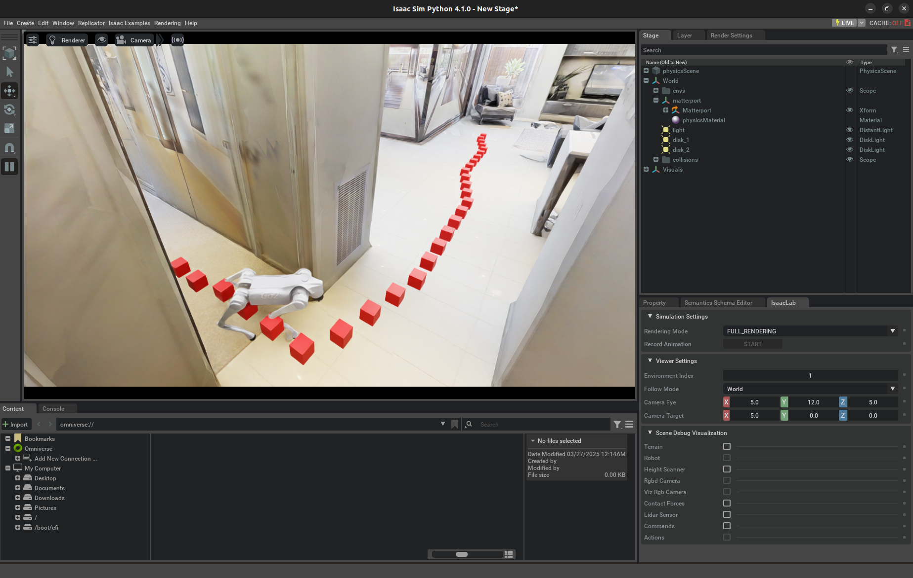

# IMPORTANT:

Belows are all the repos included in my FYP, please check them as well:

- Dataset: [https://github.com/Kenn3o3/VLN-Go2-Matterport](https://github.com/Kenn3o3/VLN-Go2-Matterport)
- Main Model: [https://github.com/Kenn3o3/Recurrent-VLN-Bert-Isaac](https://github.com/Kenn3o3/Recurrent-VLN-Bert-Isaac)
- LLM Case Study: [https://github.com/Kenn3o3/MCoT-LLM-VLN](https://github.com/Kenn3o3/MCoT-LLM-VLN)

# Embodied AI for Navigation with Quadruped Robots

[**WONG Lik Hang Kenny**](https://kenn3o3.github.io/)

[[Paper & Appendices]()] [[GitHub](https://github.com/Kenn3o3/FYP-Navigator)]

After setting up this repository, you will be able to run a demo quadruped robot in the simulator like below:



## Final Project Code Structure

```
├─ ~/fyp
|   ├── FYP-Navigator
|   ├── IsaacLab
|   ├── MCoT-LLM-VLN
|   ├── Recurrent-VLN-Bert-Isaac
|   └── VLN-Go2-Matterport
```

## Project Codebase Setup (For OS: Ubuntu 22.04)

### Install Simulator 

Install Omniverse Isaac Sim following: 

1. https://docs.isaacsim.omniverse.nvidia.com/4.5.0/installation/download.html and download the version 4.1.0
2. do the following:
    ```
    mkdir ~/isaacsim
    cd ~/Downloads
    unzip "isaac-sim-standalone@4.1.0-rc.7+4.1.14801.71533b68.gl.linux-x86_64.release.zip" -d ~/isaacsim
    cd ~/isaacsim
    ./post_install.sh
    ./isaac-sim.selector.sh
    ```
3. Set up Project Directory
    ```
    cd ~
    mkdir fyp
    cd fyp
    ```

### Setup VLN-CE-Isaac Environment 

Please refer to this amazing repository [VLN-CE-Isaac](https://github.com/yang-zj1026/VLN-CE-Isaac/tree/main) for the original code. My code from the isaaclab_exts, scripts, the pre-trained low level policy and the huggingface datasets are directly adapted from that repository to make this project repository self-contained.

Commands to set up the VLN-CE-Isaac environment: 

```
conda create -n isaaclab python=3.10
conda activate isaaclab
pip install isaacsim-rl==4.1.0 isaacsim-replicator==4.1.0 isaacsim-extscache-physics==4.1.0 isaacsim-extscache-kit-sdk==4.1.0 isaacsim-extscache-kit==4.1.0 isaacsim-app==4.1.0 --extra-index-url https://pypi.nvidia.com
git clone https://github.com/yang-zj1026/IsaacLab.git
cd IsaacLab
cd source/extensions
ln -s /home/prj21/fyp/FYP-Navigator/isaaclab_exts/omni.isaac.vlnce .
ln -s /home/prj21/fyp/FYP-Navigator/isaaclab_exts/omni.isaac.matterport .
cd ../..
./isaaclab.sh -i none
./isaaclab.sh -p -m pip install /home/prj21/fyp/FYP-Navigator/scripts/rsl_rl
```

Download the VLN-CE-Isaac Datasets from [this link](https://huggingface.co/datasets/Zhaojing/VLN-CE-Isaac/tree/main) and place them in the following structure:

```
isaaclab_exts/omni.isaac.vlnce
├─ assets
|   ├─ vln_ce_isaac_v1.json.gz
|   ├─ matterport_usd
```

### Project Code setup

Clone the clone for this project:

```
cd ~/fyp

git clone https://github.com/Kenn3o3/VLN-Go2-Matterport.git

git clone https://github.com/Kenn3o3/MCoT-LLM-VLN.git

git clone https://github.com/Kenn3o3/Recurrent-VLN-Bert-Isaac.git
```

### Validate the set up

Run:
```
cd ~/fyp/FYP-Navigator
python demo.py --task=go2_matterport_vision --history_length=9 --load_run=2024-09-25_23-22-02
```

The demo file is also provided from [VLN-CE-Isaac](https://huggingface.co/datasets/Zhaojing/VLN-CE-Isaac/tree/main).

### Next Step

1. Configure the dataset according to https://github.com/Kenn3o3/VLN-Go2-Matterport

2. Run the code!

    - [MCoT-LLM-VLN](https://github.com/Kenn3o3/MCoT-LLM-VLN)

    - [Recurrent-VLN-Bert-Isaac](https://github.com/Kenn3o3/Recurrent-VLN-Bert-Isaac)

```
The documentations are polished by ChatGPT.
Moreover, ChatGPT has been used in debugging and implementing some low-level algorithms such as those involving file operations.
```